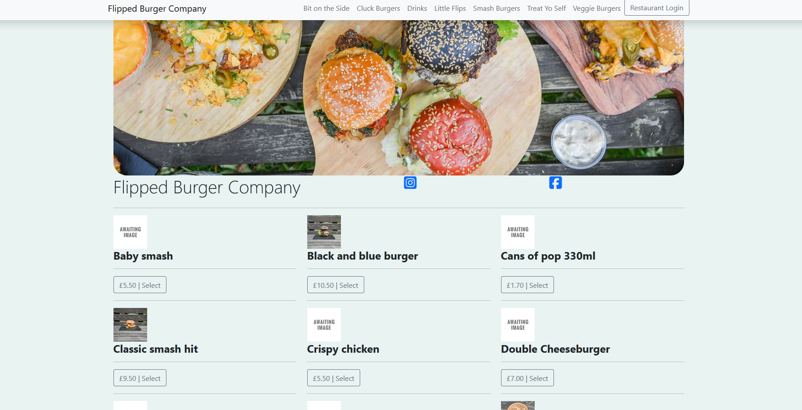
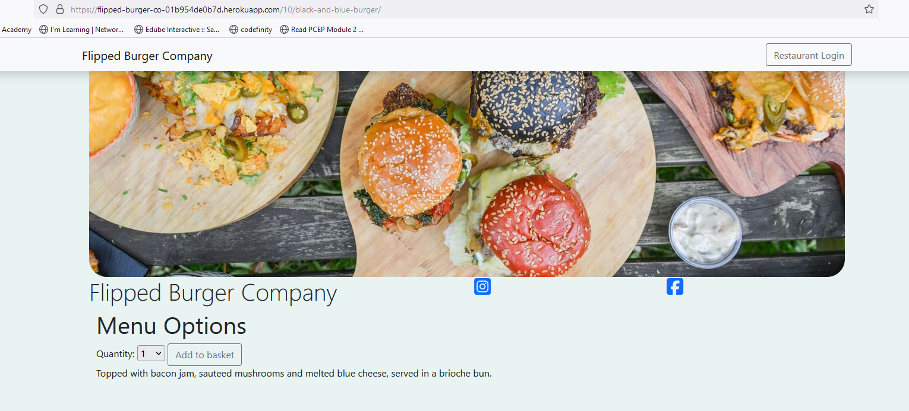
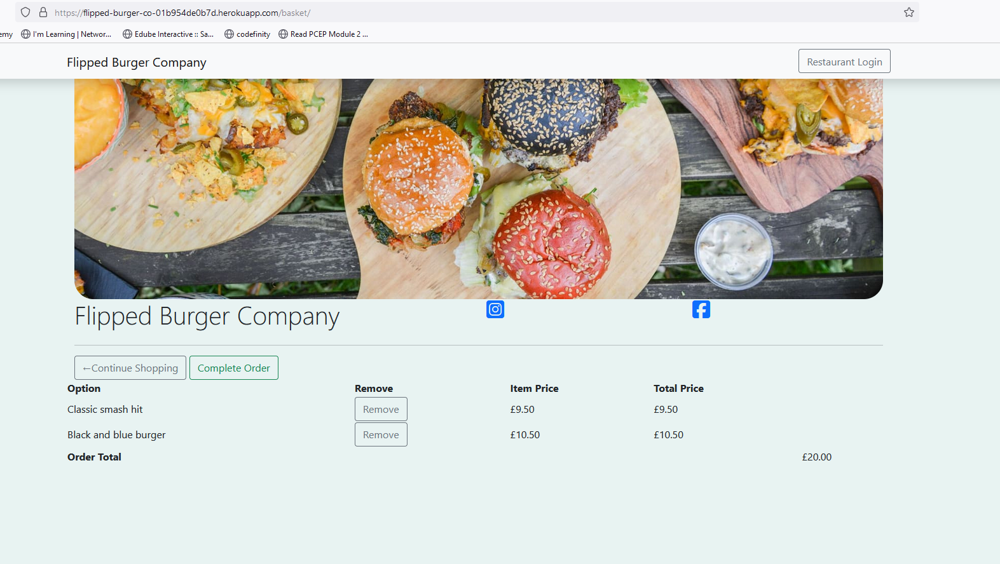
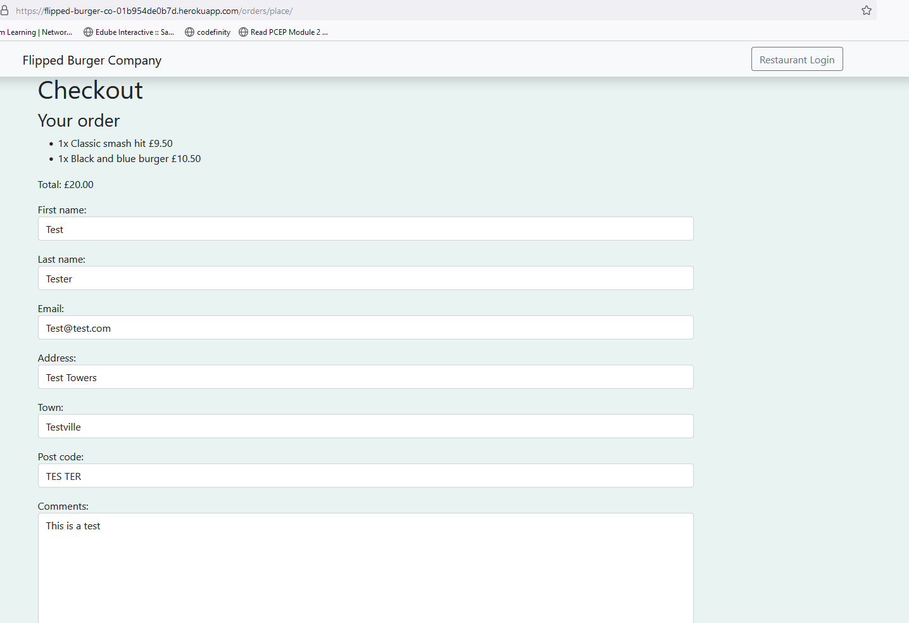
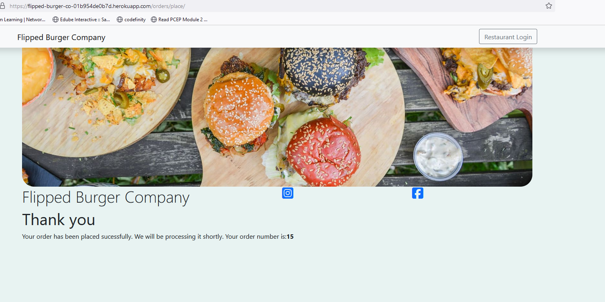
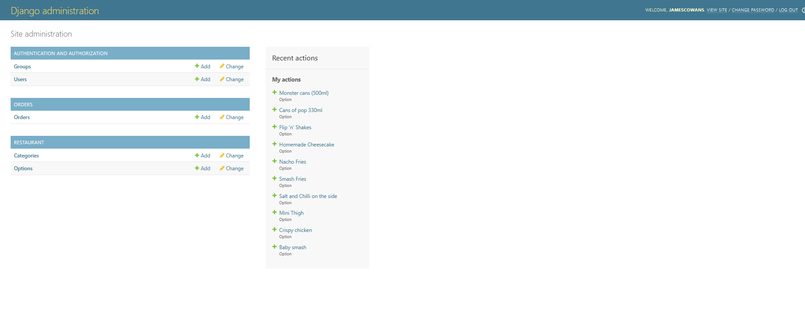
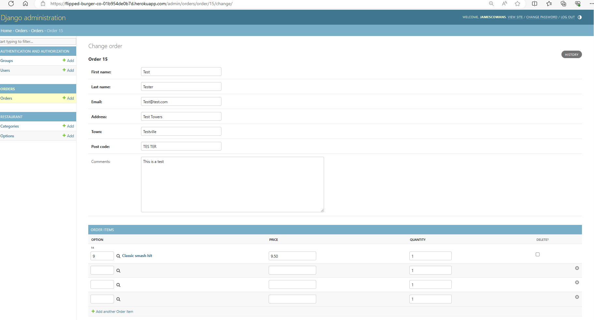

# Flipped Burger Company 

## Background

In the local area there is a small burger company. This company only use Facebook and Just Eat to run their online presence. The issue they are having is the % cut that Just Eat take, they currently only use them to allow online orders to be placed. Flipped Burger Company provide their own delivery drivers; the other side to the problem to be solved is that of banking charges, the business would be more profitable if run as a cash business and therefore not paying transaction charges.

## The Solution

The solution for these issues was to create a bespoke ordering app that allowed them to take orders online from customers who would then pay cash when collecting or using the card machine upon delivery, this would save a substantial amount of money on various charges and help the business remain profitable during economically challenging times.

# Included APPS

### Restaurant 

The restaurant app hosts the menu for the various burgers and additional side dishes.

### Orders

The orders app allows the customer to complete a form with their details prior to ordering
### Basket

The basket app holds the customers order ready to be placed.

# Models

### Restaurant

#### Category and Option models

The Category model holds the various menu categories that are available to order, i.e Veggie Burgers, Drinks

The Option model uses the Category model as an overall header and adds to it the individual items available to order within each category.

### Orders

#### Order and OrderItem models

The Order model allows for the capture of the customer details, name, address etc, this is used either for delivery or for identification purposes. There is no online payment currently as each delivery driver has a handhelp payment capture solution.

The OrderItem model captures the individual products ordered and the cost to allow the restaurant to prepare the correct order, both this and the customer details are passed through to the admin section of the database which the restaurant use to monitor orders.

### Basket

There are no models created within the basket app.

# Future development

In the future I would like to add a better social media slant to the app, galleries, competitions and the ability to win vouchers that would work at the checkout stage.

Also to add would be an online payment service when the business has expanded far enough to make it finacially viable.

# Testing 

## Automated Testing

### Orders

There has been an automated test created to check that the customer order form is working as expected and will take the correct input.

## Manual Testing

Multiple test orders have been placed via mobile and through heroku on a laptop with the results visible within the admin portal.

## This is the view of the main page on the Heroku App.

## This image shows the detail of the burger we have selected.

## This image shows the basket with the detail of what has been added.

## This image shows the checkout form the customer must fill in to complete the order.

## This shows the confirmation and order number for the test order.

## This shows the admin page the restaurant can log into to see the details of the orders.

## This shows the test order.

# Known Issues

There is an issue with the newly updated Microsoft Edge browser, it is struggles to process the URLs, this issue does not appear on mobile, tablet or mozzilla and has only appeared since the update at the end of March 2024.

Currently there is a known issue with images loading which has occured without any obvious code changes to the function

There is also an issue with the updating of the basket, when a customer updates the quantity in the basket the quantity reverts back to the original quantity.